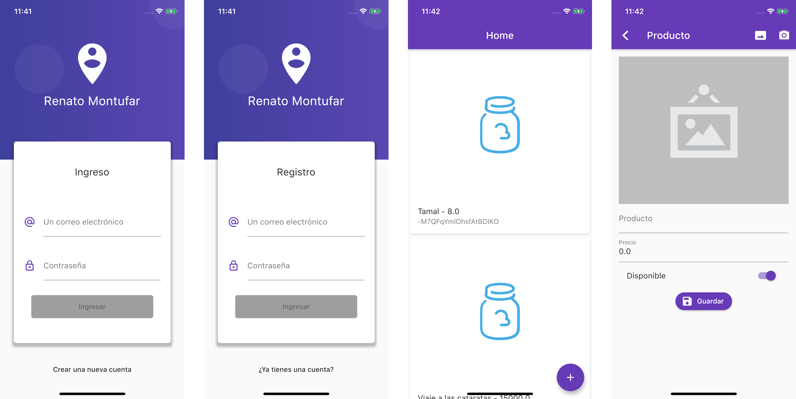

# Products App

This flutter project has a login and sigin using firebase Auth API, likewise firebase is used for data storage (products) and cloudinary is used to save the photo of a product. 
This is a practice excercise from Flutter: Tu guía completa de desarrollo para IOS y Android created by Fernando Herrrera

- Implement a Bloc pattern
- Use Bloc with forms
- Login UI/UX
- Learn and practice with InheritedWidget
- Use Streams
- Learn about validators
- Data persistence with Bloc after HotReload



## Getting Started


```
flutter get packages
```
```
flutter run
```